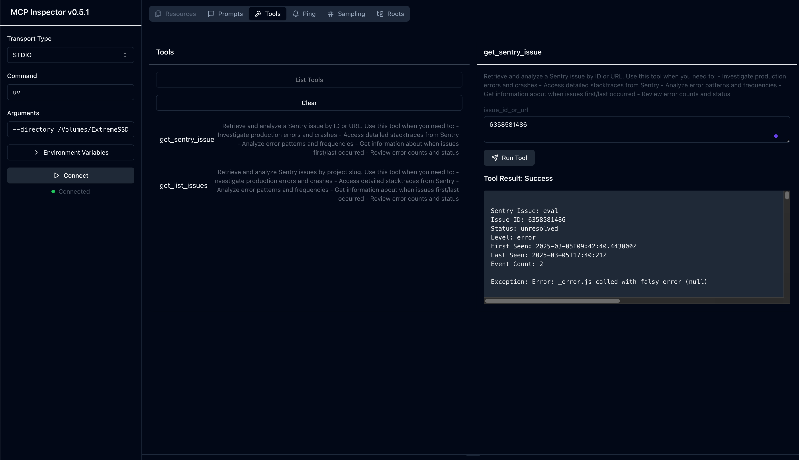

# mcp-sentry-custom: Sentry MCP 服务器

## 概述

`mcp-sentry-custom` 是一个模型上下文协议（Model Context Protocol，MCP）服务器，专为从 [Sentry.io](https://sentry.io) 或自托管 Sentry 实例中检索和分析问题而设计。该服务器提供工具，可直接从您的 Sentry 账户中检查错误报告、堆栈跟踪和其他调试信息。

## 功能特性

### 工具

1. **`get_sentry_issue`**
   - **描述**：通过 ID 或 URL 检索并分析特定的 Sentry 问题。
   - **输入**：
     - `issue_id_or_url` (字符串)：要分析的 Sentry 问题 ID 或完整 URL。
   - **返回**：详细的问题信息，包括：
     - 标题
     - 问题 ID
     - 状态
     - 级别
     - 首次发现时间戳
     - 最后发现时间戳
     - 事件计数
     - 完整堆栈跟踪

2. **`get_list_issues`**
   - **描述**：检索并分析特定项目的 Sentry 问题列表。
   - **输入**：
     - `project_slug` (字符串)：Sentry 项目标识。
     - `organization_slug` (字符串)：Sentry 组织标识。
   - **返回**：包含详细信息的问题列表，包括：
     - 标题
     - 问题 ID
     - 状态
     - 级别
     - 首次发现时间戳
     - 最后发现时间戳
     - 事件计数
     - 基本问题信息

### 提示

1. **`sentry-issue`**
   - **描述**：从 Sentry 检索格式化的问题详情，用于对话上下文。
   - **输入**：
     - `issue_id_or_url` (字符串)：Sentry 问题 ID 或 URL。
   - **返回**：格式化的问题详情。

## 安装

### 通过 Smithery 安装

要通过 [Smithery](https://smithery.ai/server/@javaDer/mcp-sentry-custom) 自动为 Claude Desktop 安装 `mcp-sentry-custom`：

```bash
npx -y @smithery/cli install @javaDer/mcp-sentry-custom --client claude
```

### 使用 `uv` (推荐)

使用 `uv` 时，无需特定安装。您可以直接使用 `uvx` 运行 `mcp-sentry-custom`：

```bash
uvx mcp-sentry-custom --auth-token YOUR_SENTRY_TOKEN --project-slug YOUR_PROJECT_SLUG --organization-slug YOUR_ORGANIZATION_SLUG --sentry-url YOUR_SENTRY_URL
```

### 使用 `pip`

或者，通过 `pip` 安装 `mcp-sentry-custom`：

```bash
pip install mcp-sentry-custom
```

或者，使用 `uv`：

```bash
uv pip install -e .
```

安装后，作为脚本运行：

```bash
python -m mcp_sentry
```

## 配置

### 与 Claude Desktop 一起使用

将以下内容添加到您的 `claude_desktop_config.json`：

#### 使用 `uvx`
```json
{
  "mcpServers": {
    "sentry": {
      "command": "uvx",
      "args": [
        "mcp-sentry-custom",
        "--auth-token", "YOUR_SENTRY_TOKEN",
        "--project-slug", "YOUR_PROJECT_SLUG",
        "--organization-slug", "YOUR_ORGANIZATION_SLUG",
        "--sentry-url", "YOUR_SENTRY_URL"
      ]
    }
  }
}
```

#### 使用 Docker
```json
{
  "mcpServers": {
    "sentry": {
      "command": "docker",
      "args": [
        "run", "-i", "--rm",
        "mcp/sentry",
        "--auth-token", "YOUR_SENTRY_TOKEN",
        "--project-slug", "YOUR_PROJECT_SLUG",
        "--organization-slug", "YOUR_ORGANIZATION_SLUG",
        "--sentry-url", "YOUR_SENTRY_URL"
      ]
    }
  }
}
```

#### 使用 `pip` 安装
```json
{
  "mcpServers": {
    "sentry": {
      "command": "python",
      "args": [
        "-m", "mcp_sentry",
        "--auth-token", "YOUR_SENTRY_TOKEN",
        "--project-slug", "YOUR_PROJECT_SLUG",
        "--organization-slug", "YOUR_ORGANIZATION_SLUG",
        "--sentry-url", "YOUR_SENTRY_URL"
      ]
    }
  }
}
```

### 与 Zed 一起使用

将以下内容添加到 Zed 中的 `settings.json`：

#### 使用 `uvx`
```json
{
  "context_servers": {
    "mcp-sentry-custom": {
      "command": {
        "path": "uvx",
        "args": [
          "mcp-sentry-custom",
          "--auth-token", "YOUR_SENTRY_TOKEN",
          "--project-slug", "YOUR_PROJECT_SLUG",
          "--organization-slug", "YOUR_ORGANIZATION_SLUG",
          "--sentry-url", "YOUR_SENTRY_URL"
        ]
      }
    }
  }
}
```

#### 使用 `pip` 安装
```json
{
  "context_servers": {
    "mcp-sentry-custom": {
      "command": "python",
      "args": [
        "-m", "mcp_sentry",
        "--auth-token", "YOUR_SENTRY_TOKEN",
        "--project-slug", "YOUR_PROJECT_SLUG",
        "--organization-slug", "YOUR_ORGANIZATION_SLUG",
        "--sentry-url", "YOUR_SENTRY_URL"
      ]
    }
  }
}
```

#### 使用 `pip` 安装并自定义路径
```json
{
  "context_servers": {
    "mcp-sentry-custom": {
      "command": "python",
      "args": [
        "-m", "mcp_sentry",
        "--auth-token", "YOUR_SENTRY_TOKEN",
        "--project-slug", "YOUR_PROJECT_SLUG",
        "--organization-slug", "YOUR_ORGANIZATION_SLUG",
        "--sentry-url", "YOUR_SENTRY_URL"
      ],
      "env": {
        "PYTHONPATH": "path/to/mcp-sentry-custom/src"
      }
    }
  }
}
```

## 调试

使用 MCP 检查器来调试服务器。

### 对于 `uvx` 安装
```bash
npx @modelcontextprotocol/inspector uvx mcp-sentry-custom --auth-token YOUR_SENTRY_TOKEN --project-slug YOUR_PROJECT_SLUG --organization-slug YOUR_ORGANIZATION_SLUG --sentry-url YOUR_SENTRY_URL
```

### 对于本地开发
如果您已在特定目录中安装了该包或正在开发它：

```bash
cd path/to/mcp-sentry-custom/src
npx @modelcontextprotocol/inspector uv run mcp-sentry-custom --auth-token YOUR_SENTRY_TOKEN --project-slug YOUR_PROJECT_SLUG --organization-slug YOUR_ORGANIZATION_SLUG --sentry-url YOUR_SENTRY_URL
```

或者，使用自定义目录：

```bash
npx @modelcontextprotocol/inspector uv --directory /path/to/mcp-sentry-custom/src run mcp_sentry --auth-token YOUR_SENTRY_TOKEN --project-slug YOUR_PROJECT_SLUG --organization-slug YOUR_ORGANIZATION_SLUG --sentry-url YOUR_SENTRY_URL
```

## 项目来源

本项目派生自：  
[https://github.com/modelcontextprotocol/servers/tree/main/src/sentry](https://github.com/modelcontextprotocol/servers/tree/main/src/sentry)

## 许可证

此 MCP 服务器根据 [MIT 许可证](LICENSE) 授权。您可以自由使用、修改和分发该软件，但须遵守 MIT 许可证的条款和条件。有关更多详细信息，请参阅项目存储库中的 `LICENSE` 文件。

---


